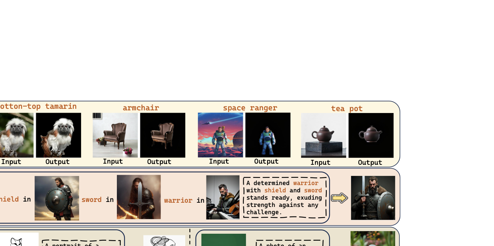
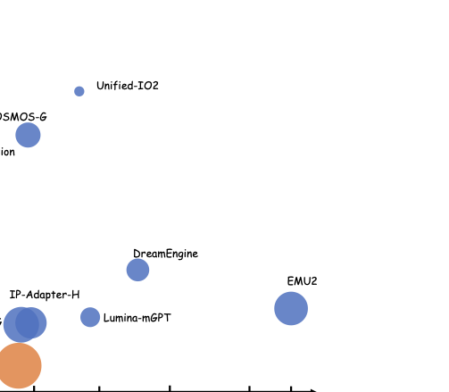
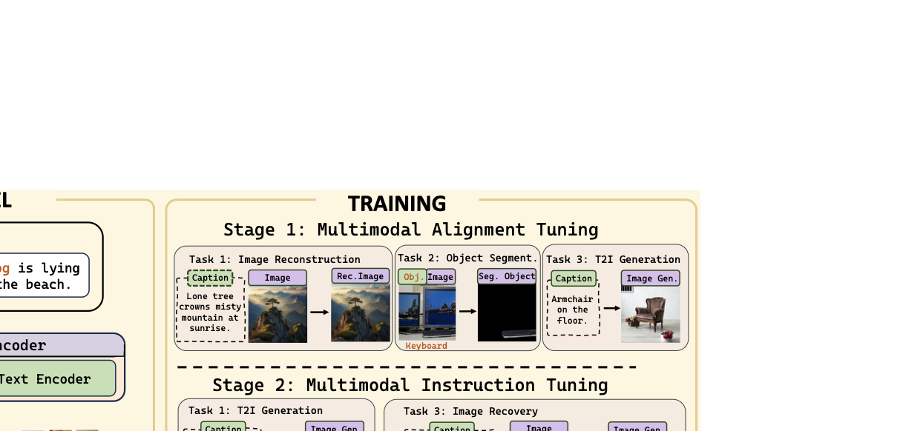
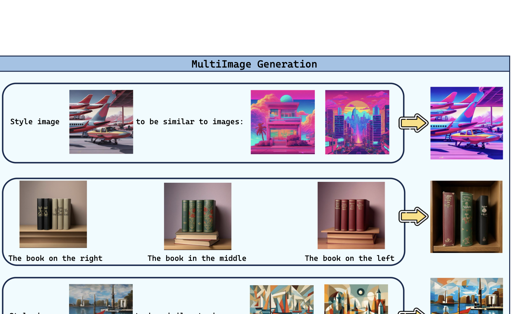
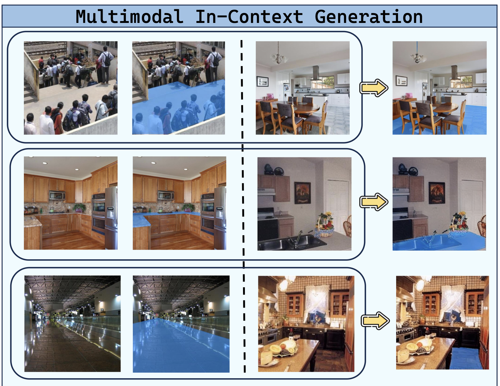

# 🚀 MENTOR: Efficient Multimodal-Conditioned Tuning for Autoregressive Vision Generation

<div align="center">

[](https://arxiv.org/abs/XXXX.XXXXX)
[](https://mentor.github.io)
[](https://huggingface.co/MENTOR)
[](https://huggingface.co/spaces/MENTOR/demo)

<h3>🏆 State-of-the-Art Multimodal Image Generation with 10× Less Data</h3>

<p align="center">
  
</p>

**[📄 Paper](https://arxiv.org/abs/XXXX.XXXXX)** | **[🎬 Video](https://youtube.com)** | **[💻 Code](#installation)** | **[🤗 Models](https://huggingface.co/MENTOR)** | **[📊 Results](#main-results)**

</div>

---

## 🎯 Why MENTOR?

<div align="center">
<table>
<tr>
<th>🔥 10× Less Training Data</th>
<th>⚡ 170× Faster Training</th>
<th>💪 Better Performance</th>
</tr>
<tr>
<td align="center">3M vs 16-200M samples</td>
<td align="center">1.5 days vs 256 GPU-days</td>
<td align="center">47% vs 36% CP·PF score</td>
</tr>
</table>
</div>

**MENTOR** revolutionizes multimodal image generation by achieving superior results with dramatically reduced resources. While competitors like Emu2 require 37B parameters and massive datasets, MENTOR delivers better performance with just 2.3B parameters.

<details>
<summary><b>📋 Table of Contents</b></summary>

- [Key Features](#-key-features)
- [Quick Start](#-quick-start)
- [Main Results](#-main-results)
- [Method Overview](#-method-overview)
- [Installation](#-installation)
- [Usage Examples](#-usage-examples)
- [Model Zoo](#-model-zoo)
- [Technical Details](#-technical-details)
- [Citation](#-citation)

</details>

---

## ✨ Key Features

<div align="center">

| Feature | MENTOR | Diffusion Models |
|---------|--------|------------------|
| **Training Efficiency** | ✅ 1.5 days on 8 GPUs | ❌ 3+ days on 256 GPUs |
| **Deterministic Control** | ✅ Precise AR generation | ❌ Stochastic sampling |
| **Modality Balance** | ✅ Lowest CP/PF ratio (0.65) | ❌ High imbalance (>1.0) |
| **Architecture** | ✅ Simple unified transformer | ❌ Complex auxiliary modules |
| **Multi-task Support** | ✅ Zero-shot adaptation | ❌ Task-specific tuning |

</div>

## 🚀 Quick Start

```bash
# Install MENTOR
pip install mentor-gen

# Generate with one line of code
from mentor import MENTOR
model = MENTOR.from_pretrained("MENTOR/mentor-mlp")
image = model.generate(
    text="A corgi wearing sunglasses on the beach",
    reference_image="path/to/corgi.jpg"
)
```

<div align="center">
  <a href="https://colab.research.google.com/drive/xxx" target="_blank">
    
  </a>
  <a href="https://huggingface.co/spaces/MENTOR/demo" target="_blank">
    
  </a>
</div>

---

## 📊 Main Results

### 🏅 DreamBench++ Benchmark Leadership

<p align="center">

</p>

<div align="center">

| Method | Model Size | Training Data | CP↑ | PF↑ | **CP·PF↑** | CP/PF↓ |
|:-------|:----------:|:-------------:|:---:|:---:|:----------:|:------:|
| Emu2 | 37B | 16M | 0.53 | 0.69 | 0.36 | 0.77 |
| DreamEngine | 10.5B | 21M | 0.68 | 0.37 | 0.26 | 1.84 |
| Kosmos-G | 3B | 200M | 0.54 | 0.51 | 0.28 | 1.06 |
| **MENTOR** | **2.3B** | **3M** | **0.55** | **0.84** | **0.47** | **0.65** |

</div>

> **CP**: Concept Preservation | **PF**: Prompt Following | **Lower CP/PF = Better Balance**

### 🎨 Superior Image Reconstruction

<div align="center">

| Method | COCO L2↓ | JourneyDB L2↓ | Improvement |
|:-------|:--------:|:-------------:|:-----------:|
| DreamEngine | 0.2065 | 0.2052 | Baseline |
| **MENTOR** | **0.1008** | **0.0867** | **>50% Better** |

</div>

---

## 🏗️ Method Overview

### Two-Stage Training Paradigm

<p align="center">

</p>

<div align="center">

| Stage | Purpose | Tasks | Training Time |
|:------|:--------|:------|:-------------:|
| **Stage 1** | Multimodal Alignment | • Image Reconstruction<br>• Object Segmentation<br>• T2I Generation | 14 hours |
| **Stage 2** | Instruction Tuning | • Image Recovery<br>• Subject-driven Gen<br>• Balanced Integration | 20 hours |

</div>

### Architecture Components

<details>
<summary><b>🔧 Click to expand technical architecture</b></summary>

#### Multimodal Encoder
- **Vision**: CLIP-Large-Patch14 (frozen)
- **Language**: FlanT5-XL 
- **Connector Options**:
  - **MLP-based**: Full visual detail preservation (256 tokens/image)
  - **Query-based**: Efficient token compression (32 tokens/image)

#### Autoregressive Decoder
- **Base Model**: LlamaGen-XL (775M parameters)
- **Vocabulary**: Shared with VQGAN tokenizer
- **Generation**: Deterministic next-token prediction

</details>

---

## 💻 Installation

<details>
<summary><b>Requirements</b></summary>

- Python ≥ 3.8
- PyTorch ≥ 2.1.0
- CUDA ≥ 11.8
- 8× NVIDIA A100 GPUs (80GB) for training
- 1× GPU (24GB) for inference

</details>

```bash
# Clone repository
git clone https://github.com/HaozheZhao/MENTOR.git
cd MENTOR

# Install dependencies
pip install -r requirements.txt

# Download pretrained models
python scripts/download_models.py
```

---

## 🎯 Usage Examples

### Basic Generation

```python
from mentor import MENTOR

# Load model
model = MENTOR.from_pretrained("MENTOR/mentor-mlp")

# Text-to-Image
image = model.generate(text="A majestic mountain at sunset")

# Subject-driven generation
image = model.generate(
    text="A dog playing piano",
    reference_image="path/to/dog.jpg"
)

# Multi-image generation (Query variant)
model_query = MENTOR.from_pretrained("MENTOR/mentor-query")
image = model_query.generate(
    text="Combine these styles",
    reference_images=["style1.jpg", "style2.jpg", "style3.jpg"]
)
```

### Advanced Features

<details>
<summary><b>🔍 Text-Guided Segmentation</b></summary>

```python
mask = model.segment(
    image="path/to/image.jpg",
    text="the red car"
)
```

</details>

<details>
<summary><b>🎨 In-Context Learning</b></summary>

```python
# Provide examples for few-shot adaptation
examples = [
    {"input": "sketch1.jpg", "output": "colored1.jpg"},
    {"input": "sketch2.jpg", "output": "colored2.jpg"}
]
result = model.in_context_generate(
    examples=examples,
    query="sketch3.jpg"
)
```

</details>

---

## 🤖 Model Zoo

<div align="center">

| Model | Type | Context | Multi-Image | Download |
|:------|:-----|:-------:|:-----------:|:--------:|
| MENTOR-MLP | Full Detail | 256 tokens/img | ❌ | [🤗 HF Hub](https://huggingface.co/MENTOR/mentor-mlp) |
| MENTOR-Query | Efficient | 32 tokens/img | ✅ (14 imgs) | [🤗 HF Hub](https://huggingface.co/MENTOR/mentor-query) |
| MENTOR-Multi | Extended | 1280 tokens | ✅ (4 imgs) | [🤗 HF Hub](https://huggingface.co/MENTOR/mentor-multi) |

</div>

---

## 🔬 Technical Details

<details>
<summary><b>📐 Mathematical Formulation</b></summary>

### Training Objective
Given multimodal inputs **c** = {I, T}, the encoder φ produces:
```
H = MLP(φ(c)) = (h₁, ..., hₘ) ∈ ℝᴹˣᵈ
```

The AR decoder θ generates image sequence **y**:
```
θ(y | H) = ∏ᵢ₌₁ᴸ θ(yᵢ | y<ᵢ, H)
```

### Classifier-Free Guidance
- Training: Replace H with Hᵤ with probability p = 0.1
- Inference: ℓ_g = ℓ_u + (ℓ_c - ℓ_u) × λ

</details>

<details>
<summary><b>🔧 Training Configuration</b></summary>

### Hyperparameters
- **Optimizer**: AdamW (β₁=0.9, β₂=0.999)
- **Learning Rate**: Stage 1: 5e-4, Stage 2: 1e-4
- **Batch Size**: 128 (global)
- **Warmup**: 5% of total steps
- **Schedule**: Cosine decay

### Hardware Requirements
- **Training**: 8× A100 80GB (~34 hours total)
- **Inference**: 1× GPU 24GB+ 
- **Memory**: ~60GB peak during training

</details>

<details>
<summary><b>📊 Extended Results</b></summary>

### Ablation Studies

| Configuration | CP | PF | CP·PF |
|:--------------|:--:|:--:|:-----:|
| Full Model | 0.555 | 0.839 | 0.466 |
| w/o Stage 1 | 0.179 | 0.673 | 0.120 |
| w/o Image Recovery | 0.661 | 0.284 | 0.188 |
| w/o Segmentation | 0.412 | 0.918 | 0.378 |

### ROPE Fix for LlamaGen
We identified and corrected a critical bug in LlamaGen's 2D ROPE implementation that was causing information loss. Our fix required retraining on the original datasets before fine-tuning.

</details>

---

## 🌟 Gallery

<details>
<summary><b>View more examples</b></summary>

### Image Reconstruction
<p align="center">

</p>

### Multi-Subject Generation
<p align="center">

</p>

### In-Context Learning
<p align="center">

</p>

</details>

---

## 📚 Citation

If you find MENTOR useful, please cite our paper:

```bibtex
@inproceedings{zhao2024mentor,
  title={MENTOR: Efficient Multimodal-Conditioned Tuning for Autoregressive Vision Generation Models},
  author={Zhao, Haozhe* and Cai, Zefan* and Si, Shuzheng and Chen, Liang and 
          Gu, Jiuxiang and Xiao, Wen and Hu, Junjie},
  booktitle={Advances in Neural Information Processing Systems (NeurIPS)},
  year={2024}
}
```

---

## 🤝 Contributing

We welcome contributions! Please see our [Contributing Guidelines](CONTRIBUTING.md) for details.

## 📄 License

This project is licensed under the MIT License - see [LICENSE](LICENSE) for details.

## 🙏 Acknowledgments

We thank the teams behind LlamaGen, CLIP, FlanT5, and DreamBench++ for their foundational contributions.

---

<div align="center">
<p>
<a href="https://github.com/HaozheZhao/MENTOR/issues">🐛 Report Bug</a> •
<a href="https://github.com/HaozheZhao/MENTOR/issues">💡 Request Feature</a> •
<a href="https://discord.gg/mentor">💬 Join Discord</a>
</p>

<p><b>Made with ❤️ by the MENTOR Team</b></p>
</div>