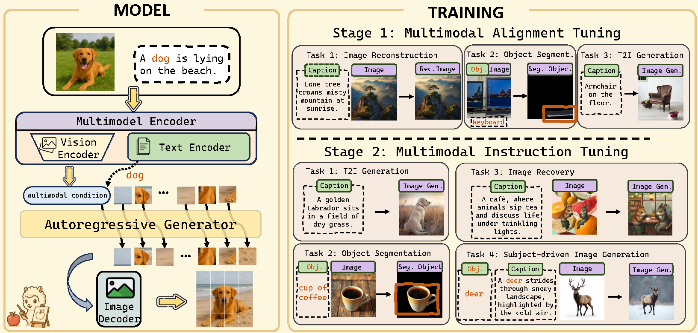

# 🚀 MENTOR: Efficient Multimodal-Conditioned Tuning for Autoregressive Vision Generation

<div align="center">

[](https://arxiv.org/abs/1234.56789)
[](https://haozhezhao.github.io/MENTOR.page)
[](https://huggingface.co/MENTOR)
<!-- [](https://huggingface.co/spaces/MENTOR/demo) -->

<h3>🏆 Efficient Autoregressive Multimodal Image Generation with 10× Less Data</h3>

<p align="center">
  
</p>

**[📄 Paper](https://arxiv.org/abs/XXXX.XXXXX)** | **[💻 Code](https://github.com/HaozheZhao/MENTOR)** | **[🤗 Models](https://huggingface.co/MENTOR)** | **[🤗 Stage1 Data](https://huggingface.co/datasets/BleachNick/Mentor_Stage1)**| | **[🤗 Stage2 Data](https://huggingface.co/datasets/BleachNick/Mentor_Stage2)**| 

</div>

---

## 🎯 Why MENTOR?

<div align="center">
<table>
<tr>
<th>🔥 10× Less Training Data</th>
<th>⚡ Faster Training</th>
<th>💪 Better Performance</th>
</tr>
<tr>
<td align="center">3M vs 16-200M samples</td>
<td align="center">1.5 days in 8*A100 GPU</td>
<td align="center">0.47 CP·PF score</td>
</tr>
</table>
</div>

**MENTOR** demonstrates competitive multimodal image generation capabilities, achieving superior results with dramatically reduced resources thanks to an efficient tuning paradigm. While competitors like Emu2 require 37 billion parameters and vast datasets, MENTOR surpasses their performance with only 2.3 billion parameters and significantly less training data in an autoregressive vision generation framework.

<details>
<summary><b>📋 Table of Contents</b></summary>

- [Key Features](#-key-features)
- [Quick Start](#-quick-start)
- [Main Results](#-main-results)
- [Method Overview](#-method-overview)
- [Usage Examples](#-usage-examples)
<!-- - [Model Zoo](#-model-zoo) -->
- [Technical Details](#-technical-details)
- [Citation](#-citation)

</details>

---

## ✨ Key Features

<div align="center">

| Feature | MENTOR | Diffusion-Based Models |
|---------|--------|------------------|
| **Training Efficiency** | ✅ 1.5 days on 8 GPUs | ❌ 3+ days on 256 GPUs |
| **Deterministic Control** | ✅ Precise AR generation | ❌ Stochastic sampling |
| **Modality Balance** | ✅ Lowest CP/PF ratio (0.65) | ❌ High imbalance (>1.0) |
| **Architecture** | ✅ Simple unified transformer | ❌ Complex auxiliary modules |
<!-- | **Multi-task Support** | ✅ Zero-shot adaptation | ❌ Task-specific tuning | -->

</div>

## 🚀 Quick Start

### 💻 Installation


<details>
<summary><b>Requirements</b></summary>

- Python ≥ 3.11
- PyTorch ≥ 2.5.1
- CUDA ≥ 12.1
- 8× NVIDIA A100 GPUs (80GB) for training

</details>

```bash
# Clone repository
git clone https://github.com/HaozheZhao/MENTOR.git
cd MENTOR

# Install dependencies
conda env create --file environment.yml

```

### 📥 Download Dataset and Model
```bash
# Download model checkpoints
huggingface-cli download BleachNick/Mentor --local-dir Mentor

# Download Stage-1 dataset
huggingface-cli download BleachNick/Mentor_Stage1 --repo-type dataset --local-dir Mentor_Stage1
cd Mentor_Stage1
cat stage1_data.tar.gz.part-* | pv | tar -xzf -
cd ..

# Download Stage-2 dataset
huggingface-cli download BleachNick/Mentor_Stage2 --repo-type dataset --local-dir Mentor_Stage2
cd Mentor_Stage2
cat stage2_data.tar.gz.part-* | pv | tar -xzf -
cd ..
```

### 🏋️‍♂️ Training
```bash
# Stage 1 training
bash scripts/autoregressive/train_stage1.sh

# Stage 2 training
bash scripts/autoregressive/train_stage2.sh

# Run ablation experiments
bash scripts/autoregressive/ablation.sh
```


<!-- <div align="center">
  <a href="https://colab.research.google.com/drive/xxx" target="_blank">
    
  </a>
  <a href="https://huggingface.co/spaces/MENTOR/demo" target="_blank">
    
  </a>
</div> -->

---

## 📊 Main Results

### 🏅 DreamBench++ Benchmark Leadership

<p align="center">

</p>

<div align="center">

| Method | Model Size | Training Data | CP↑ | PF↑ | **CP·PF↑** | **CP/PF↓** |
|:-------|:----------:|:-------------:|:---:|:---:|:----------:|:------:|
| DreamEngine | 10.5B | 21M | 0.68 | 0.37 | 0.26 | 1.84 |
| Kosmos-G | 3B | 200M | 0.54 | 0.51 | 0.28 | 1.06 |
| Emu2 | 37B | 16M | 0.53 | 0.69 | 0.36 | 0.77 |
| IP-Adapter ViT-G | 2.5B | 10M | 0.59 | 0.64 | 0.38 | 0.92 |
| **MENTOR** | **2.3B** | **3M** | 0.55 | 0.84 | **0.47** | **0.65** |

</div>

> **CP**: Concept Preservation | **PF**: Prompt Following | **Lower CP/PF = Better Balance**

### 🎨 Superior Image Reconstruction

<div align="center">

| Method         | COCO L2↓ | JourneyDB L2↓ | Improvement      |
|:---------------|:--------:|:-------------:|:----------------:|
| SeedTokenizer  | 0.5102   | 0.5291        | \          |
| SEED-X         | 0.4317   | 0.4352        | \          |
| EMU2-Gen       | 0.3828   | 0.2869        | \           |
| DreamEngine    | 0.2065   | 0.2052        | Baseline         |
| **MENTOR**     | **0.1008** | **0.0867**  | **~50% Better** |


</div>

---

## 🏗️ Method Overview

### Two-Stage Training Paradigm

<p align="center">

</p>

<div align="center">

| Stage | Purpose | Tasks | Training Time |
|:------|:--------|:------|:-------------:|
| **Stage 1** | Multimodal Alignment | • Image Reconstruction<br>• Object Segmentation<br>• T2I Generation | 14 hours |
| **Stage 2** | Instruction Tuning | • Image Recovery<br>• Subject-driven Gen<br>• Balanced Integration | 20 hours |

</div>

### Architecture Components

<details>
<summary><b>🔧 Click to expand technical architecture</b></summary>

#### Multimodal Encoder
- **Vision**: CLIP-Large-Patch14 (frozen)
- **Language**: FlanT5-XL 
- **Connector Options**:
  - **MLP-based**: Full visual detail preservation (256 tokens/image)
  - **Query-based**: Efficient token compression (32 tokens/image)

#### Autoregressive Decoder
- **Base Model**: LlamaGen-XL (775M parameters)
- **Vocabulary**: Shared with VQGAN tokenizer
- **Generation**: Deterministic next-token prediction

</details>


---

## 🎯 Usage Examples

### Basic Generation

```
  python demo.py \
      --image_path cat.jpg \
      --prompt "A cat in <image>.\n A cat in a 16-bit fantasy pixel-art scene" \
      --gpt_ckpt Mentor/stage2.pt \
      --vq_ckpt  Mentor/vq_ds16_t2i.pt \
      --output out/cat_pixel.jpg \
      --mm_vision_tower "openai/clip-vit-large-patch14" \
      --multimodal_encoder llava \
```
<!-- 
### Advanced Features

<details>
<summary><b>🔍 Text-Guided Segmentation</b></summary>

```python
mask = model.segment(
    image="path/to/image.jpg",
    text="the red car"
)
```

</details>

<details>
<summary><b>🎨 In-Context Learning</b></summary>

```python
# Provide examples for few-shot adaptation
examples = [
    {"input": "sketch1.jpg", "output": "colored1.jpg"},
    {"input": "sketch2.jpg", "output": "colored2.jpg"}
]
result = model.in_context_generate(
    examples=examples,
    query="sketch3.jpg"
)
```

</details> --> 
<!-- --- -->
<!-- 
## 🤖 Model Zoo

<div align="center">

| Model | Type | Context | Multi-Image | Download |
|:------|:-----|:-------:|:-----------:|:--------:|
| MENTOR-MLP connector | Extended | 1280 tokens | ✅ (4 imgs) | [🤗 HF Hub](https://huggingface.co/MENTOR/mentor-multi) |
| T2I-Generator | Full Detail | 256 tokens/img | ❌ | [🤗 HF Hub](https://huggingface.co/MENTOR/mentor-mlp) |
| MENTOR-Stage1 | Full Detail | 256 tokens/img | ❌ | [🤗 HF Hub](https://huggingface.co/MENTOR/mentor-mlp) |
| MENTOR-Stage2 | Efficient | 32 tokens/img | ✅ (14 imgs) | [🤗 HF Hub](https://huggingface.co/MENTOR/mentor-query) |

</div>

--- -->

## 🔬 Technical Details

<details>
<summary><b>📐 Mathematical Formulation</b></summary>

### Training Objective
Given multimodal inputs **c** = {I, T}, the encoder φ produces:
```
H = MLP(φ(c)) = (h₁, ..., hₘ) ∈ ℝᴹˣᵈ
```

The AR decoder θ generates image sequence **y**:
```
θ(y | H) = ∏ᵢ₌₁ᴸ θ(yᵢ | y<ᵢ, H)
```

### Classifier-Free Guidance
- Training: Replace H with Hᵤ with probability p = 0.1
- Inference: ℓ_g = ℓ_u + (ℓ_c - ℓ_u) × λ

</details>

<details>
<summary><b>🔧 Training Configuration</b></summary>

### Hyperparameters
- **Optimizer**: AdamW
- **Learning Rate**: Stage 1: 5e-4, Stage 2: 1e-4
- **Batch Size**: 96 for stage1 and 64 for stage 2(global)
- **Warmup**: 5% of total steps
- **Schedule**: Cosine decay

### Hardware Requirements
- **Training**: 8× A100 80GB (~34 hours total)
- **Inference**: 1× GPU 24GB+ 

</details>

<details>
<summary><b>📊 Extended Results</b></summary>

### Ablation Studies

| Configuration | CP | PF | CP·PF |
|:--------------|:--:|:--:|:-----:|
| Full Model | 0.555 | 0.839 | 0.466 |
| w/o Stage 1 | 0.179 | 0.673 | 0.120 |
| w/o Image Recovery | 0.661 | 0.284 | 0.188 |
| w/o Segmentation | 0.412 | 0.918 | 0.378 |

### 🛠️ ROPE Fix for LlamaGen [#54](https://github.com/FoundationVision/LlamaGen/issues/54)

We identified and resolved a critical bug in [LlamaGen](https://github.com/FoundationVision/LlamaGen)'s 2D ROPE implementation that was causing significant information loss. Our fix required retraining the [model](https://huggingface.co/BleachNick/Mentor/blob/main/generator_ckpt.pt) prior to fine-tuning.


</details>

---

## 🌟 Gallery

<details>
<summary><b>View more examples</b></summary>

### Image Reconstruction
<p align="center">

</p>

### Multi-Subject Generation
<p align="center">

</p>

### In-Context Learning
<p align="center">

</p>

</details>

---

## 📚 Citation

If you find MENTOR useful, please cite our paper:

```bibtex
@inproceedings{zhao2024mentor,
  title={MENTOR: Efficient Multimodal-Conditioned Tuning for Autoregressive Vision Generation Models},
  author={Zhao, Haozhe* and Cai, Zefan* and Si, Shuzheng and Chen, Liang and 
          Gu, Jiuxiang and Xiao, Wen and Hu, Junjie},
  year={2024}
}
```

---
<!-- 
## 🤝 Contributing

We welcome contributions! Please see our [Contributing Guidelines](CONTRIBUTING.md) for details.

## 📄 License

This project is licensed under the MIT License - see [LICENSE](LICENSE) for details. -->

## 🙏 Acknowledgments

We thank the teams behind [LlamaGen]{https://github.com/FoundationVision/LlamaGen}, and [DreamBench++]{https://github.com/yuangpeng/dreambench_plus} for their foundational contributions.

---
<!-- 
<div align="center">
<p>
<a href="https://github.com/HaozheZhao/MENTOR/issues">🐛 Report Bug</a> •
<a href="https://github.com/HaozheZhao/MENTOR/issues">💡 Request Feature</a> •
<a href="https://discord.gg/mentor">💬 Join Discord</a>
</p>

<p><b>Made with ❤️ by the MENTOR Team</b></p>
</div> -->
